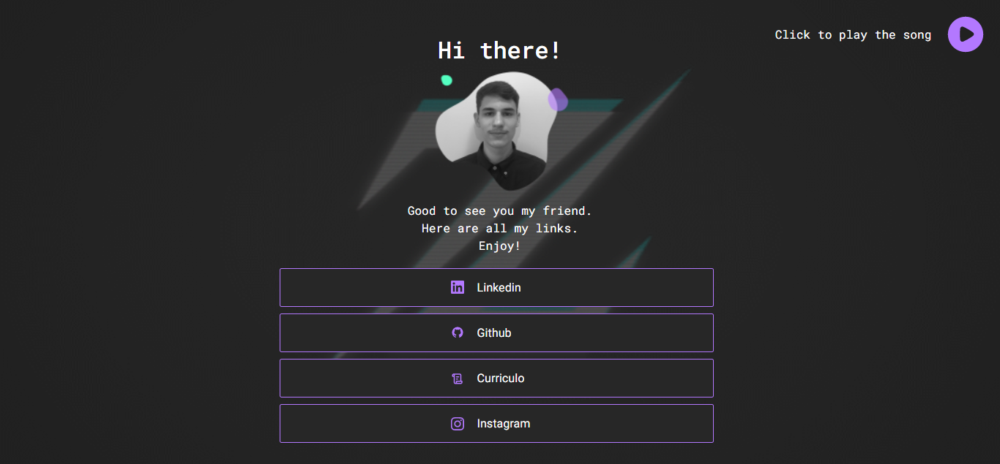

## 💻 _myLinks_

Ferramenta para organizar meus links em um só lugar.

## 💻  Projeto desenvolvido
<a href="https://gabrieldiasdev.github.io/myLinks/" target="_blank">Acesse o projeto</a>

## 👨‍💻 Autor
 

Gabriel Dias Catarin, desenvolvedor front-end | Bauru, São Paulo

[ LinkedIn](https://www.linkedin.com/in/gabriel-dias-260857207/)
&nbsp;